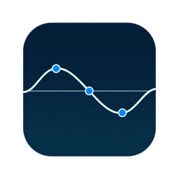
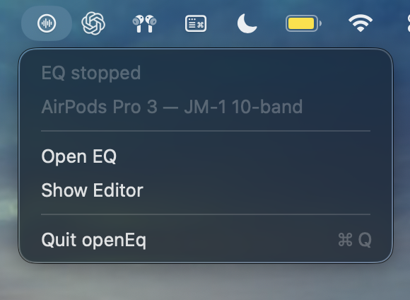
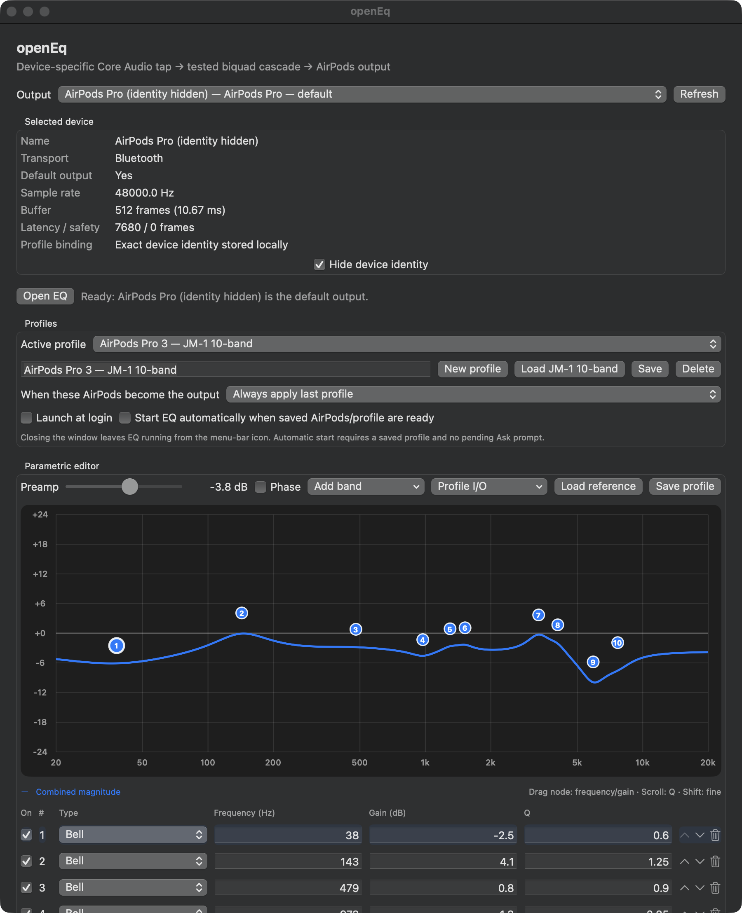

# openEq

<p align="center">
  
</p>

Open-source, system-wide parametric EQ for macOS, developed and validated with AirPods Pro 3.

openEq uses a device-specific Core Audio process tap and a private aggregate device. It processes the system output mix in a native, minimum-phase biquad cascade without installing a kernel extension, virtual audio driver, or Audio Unit host.



*Close the editor window and openEq keeps processing in the background from the menu bar. Choose **Close EQ** to restore direct audio, or **Quit openEq** to exit.*



## Highlights

- System-wide processing for the selected default output device
- Bell, low shelf, high shelf, low pass, high pass, and notch filters
- Arbitrary band count, with a 64-band real-time safety limit
- Exact frequency, gain, and Q entry
- Draggable logarithmic response graph; scroll adjusts Q
- Combined magnitude and optional unwrapped phase response
- CSV/TSV target-curve overlays
- Named, versioned JSON profiles
- Equalizer APO-style text paste/import
- Exact Core Audio device-UID profile association
- Ask, always-apply, or never-apply connection behavior
- Menu-bar-only background operation
- Optional launch at login and automatic EQ start
- Transport-aware buffers with automatic overload/stall recovery
- Live output-peak and above-0-dBFS diagnostics
- No telemetry, analytics, network client, microphone access, or cloud account

## Requirements

- macOS 14.2 or newer
- Apple-silicon Mac for the supplied local packaging script
- A live output device selected as the macOS default
- One-time **System Audio Recording** permission
- Xcode 16 or newer when building from source

openEq is not tied to an AirPods model or correction curve. It can process compatible headphones, built-in speakers, USB DACs, and other Core Audio output devices. The selected device must be the macOS default output, alive, and expose matching native-rate 32-bit floating-point tap/input/output streams. openEq refuses an incompatible route rather than resampling or silently degrading it.

AirPods Pro 3 are the most extensively tested route. Other devices can have different buffer-size and stream-layout behavior, so reports with non-personal diagnostics are welcome.

## Install and run

See [SETUP.md](SETUP.md) for source-build, DMG installation, permissions, profile import, launch-at-login, and troubleshooting instructions.

Installed application name: **openEq**. It appears in `/Applications`, Spotlight, and Launchpad. It intentionally does not remain in the Dock or Command-Tab switcher; use its waveform icon in the menu bar.

Menu actions are deliberately simple:

- **Open EQ** — start system-wide processing
- **Close EQ** — stop processing and restore direct audio
- **Show Editor** — open the full profile/editor window
- **Quit openEq** — stop and exit

## Included preset

The app bundles an **AirPods Pro 3 — JM-1 10-band** preset with `-3.8 dB` preamp and ten peaking filters. That preset is specifically for AirPods Pro 3 with ANC enabled. It is based on a population-average measurement correction, not personalized hearing data. It should not be used unchanged with other headphones. Fit, seal, firmware, volume, and individual anatomy can change the ideal correction.

Profiles can also be pasted in this form:

```text
Preamp: -3.8 dB
Filter 1: ON PK Fc 38 Hz Gain -2.5 dB Q 0.60
Filter 2: ON PK Fc 143 Hz Gain +4.1 dB Q 1.25
```

## Architecture

```text
macOS system mix for selected output
                |
                v
device-specific Core Audio process tap
                |
                v
private aggregate input/output device
                |
                v
preamp -> cascaded RBJ biquads -> selected output device
```

The app excludes its own process from the tap to prevent feedback. `CATapMutedWhenTapped` preserves fail-open behavior: stopping or destroying the tap restores the normal direct route.

The render callback uses fixed-capacity storage, atomic coefficient publication, independent per-channel filter state, and dual-bank crossfades. It performs no allocation, locking, logging, file I/O, JSON work, or UI dispatch.

## Validation

On the development AirPods route at 48 kHz, the initial latency validation measured:

- 128-frame Core Audio buffers
- 5.333 ms measured tap-to-output timestamp delta
- 0.011 ms typical / 0.024 ms observed maximum callback DSP time with 10 active bands
- zero non-finite outputs and format mismatches during the captured run
- 33 automated tests covering device eligibility, buffer policy, recovery monitoring, filter goldens, stability, cascade behavior, real-time bridging, crossfades, profile storage/import, reference curves, and legacy profile migration

A longer Bluetooth soak later exposed intermittent Core Audio overloads at 128 frames despite ample DSP headroom. The current build therefore starts Bluetooth/Bluetooth LE outputs at 256 frames, keeps 128 frames for other transports, watches health while the editor is closed, and rebuilds at up to 512 frames after an overload burst or callback stall. If recovery fails or the route remains unstable, openEq destroys the tap and restores direct audio.

AirPods reported roughly 160 ms of their own Bluetooth/device latency on that system. That baseline is separate from openEq's measured route overhead. Results vary by Mac, AirPods model, radio conditions, and macOS version.

Engineering notes and local release records are collected in [docs](docs/README.md).

## Privacy and security

openEq processes audio locally in memory. It does not save, transmit, analyze, or record audio. Profiles stay in `~/Library/Application Support/openEq/` unless explicitly exported.

See [SECURITY.md](SECURITY.md) for the threat model, permission rationale, and vulnerability reporting.

## Distribution status

The local package script creates a hardened-runtime, ad-hoc-signed app/DMG/ZIP for development and personal installation. A public binary release should use a Developer ID Application certificate and Apple notarization. Source builds do not need an audio driver or privileged installer.

## License

openEq is available under the [MIT License](LICENSE). The software is provided **as is**, without warranty; use it at your own risk. The package script embeds the license in the application and includes it in the DMG.
